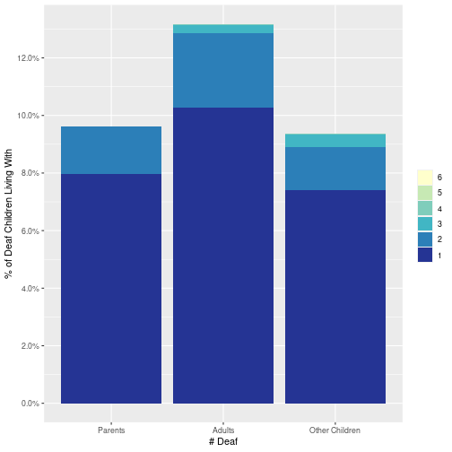

|        | Observed N| Imputed N| Observed %| Imputed %|
|:-------|----------:|---------:|----------:|---------:|
|Hearing |    2699380|    262005|   91.15262|  8.847380|
|Deaf    |     117562|      9285|   92.68016|  7.319842|


## Data

For this study we used the 2019 one-year public use microdata sample from the American Community Survey (ACS), which was pre-processed by (IPUMS USA)[http://usa.ipums.org] (Ruggles, et al. 2020)^[Steven Ruggles, Sarah Flood, Ronald Goeken, Josiah Grover, Erin Meyer, Jose Pacas and Matthew Sobek. IPUMS USA: Version 10.0 [dataset]. Minneapolis, MN: IPUMS, 2020. https://doi.org/10.18128/D010.V10.0 Retrieved 11/29/2020]. 
The ACS is a yearly survey of US households conducted by the US Census Bureau, that aims to include approximately one percent of the US population. While the ACS dataset includes individual-level information, data are collected and organized at the household level; hence, the ACS may be used to study population household characteristics. A detailed overview of ACS uses, including the material discussed below, can be found in U.S. Census Bureau (2020a)^[ U.S. Census Bureau (2020), _Understanding and Using American Community Survey Data: What All Data Users Need to Know_, U.S. Government Publishing Office, Washington, DC. [https://www.census.gov/content/dam/Census/library/publications/2020/acs/acs_general_handbook_2020.pdf] accessed 11/01/2021.].

The ACS includes two sets of survey weights for estimating population parameters--one for the population of US households, and one for the population of US individuals. In this study, we use the individual-level weights. These survey weights are designed to account for the complex survey design of the ACS, which entails that different households are randomly sampled with different probabilities, and to account for survey non-response. 
The ACS also includes a set of replication weights to be used in standard error estimation.

Although the ACS sample is intended as a representative sample of the US population, there are a number of sources of error in estimates of population quantities. 
The random sampling design results in "sampling error," which is due to the fact that the data are a random sample of the population, rather than the entire population. The extent of the sampling error can be estimated based on the design of the random sample, and is reflected in the estimated standard errors we provide. 
Like nearly all other surveys, the ACS is subject to non-sampling error as well. This, in turn, has five components. First, coverage error ocurrs if individuals in the population are excluded from the random sample by design--i.e. when subjects have a zero probability of being sampled, or when a person or household has a chance of being selected two or more times in the same sample. The ACS controls coverage error by attempting to ensure a comprehensive samping frame, as well as by comparing ACS-estimated population totals with independent estimates from other sources, and using that comparison to adjust ACS-based population estimates. The coverage rate for the total US population in 2019 (the ratio of the ACS-estimated population to an indepdent estimate) was 91.8%^[[https://www.census.gov/acs/www/methodology/sample-size-and-data-quality/coverage-rates/], accessed 11/01/2021.]. Second, unit nonresponse occurs when a housing unit does not reply to the survey. The ACS attempts to minimize unit-non-response by allowing three modes of response (internet, mail, and computer-assisted personal interview), repeated mailing, and personal visits from interviewers. The 2019 ACS had a 86.0% response rate for housing units^[[https://www.census.gov/acs/www/methodology/sample-size-and-data-quality/response-rates/index.php] accessed 11/01/2021.]. Adustments for remaining non-response, based on comparisons with independent estimates, are incorporated into the survey weights (U.S. Census Bureau 2020b)^[U.S. Census Bureau (2020), _American Community Survey
Accuracy of the Data (2019)_, U.S. Government Publishing Office, Washington, DC. [https://www2.census.gov/programs-surveys/acs/tech_docs/accuracy/ACS_Accuracy_of_Data_2019.pdf] accessed 11/01/2021.]. Third, item nonresponse occurs when a response is received from a particular household, but one of the items in the survey is not answered. In this case, the ACS includes imputed responses, estimated based on the observed responses. Finally, measurement and processing error occur when questions are answered incorrectly by the survey respondent or processed incorrectly by Census Bureau staff. A number of procedures are in place to minimize these errors, but some may remain, nevertheless. 

### Data Description

The 2019 ACS sample contains data pertaining to $n=$3,239,553 individuals, including 139,575 deaf individuals and 3,277 deaf children.
For the current study, we exclude people living in group quarters such as prisons, dormatories, or group homes. 
There were 151,321 sampled subjects in group quarters, including a total of 151,321 deaf individuals and  102 deaf children (representing an estimated 8,084,362 people, 8,084,362 whom are deaf and 4,020 are deaf children in the group quarters population.)
Excluding group quarters leaves a total sample size of 3,088,232 people, including 126,847 deaf people and 3,175 deaf children. 
This sample represents a population total of 320,155,161 people, including  deaf people and 402,331 deaf children.

Approximately 7% of people labeled as "deaf" and 9% of people labeled as "hearing" did not respond to the ACS question about hearing difficulty (i.e. item nonresponse). 
Their deaf status was instead imputed by the ACS.

    
    


The dataset includes 118,894 households with at least one deaf member. 
These represent an estimated 10,359,959$\pm$71,207 such households in the US population.
    
## Methodology

### Definitions:

For the purpose of this study, deafness is defined as a response of "Yes" to the ACS question "Is this person deaf or does he/she have serious difficulty hearing?" We define anyone under the age of 18 as a child.
  
### Inferring relationships


ACS collects one form from each household, filled out by a member of the household, called "Person 1," who responds to questions about each member of the household, including themselves.
One such question is "How is this person related to Person 1?"--that is, Person 1 is asked to list their [nb: how do we do gender? this is the "singular their"] relationship to each other household member.
IPUMS infers family interrelationships within a household using responses to this question, in addition to supplementary information such as subjects' surnames (which IPUMS has access to, but which are not public) and the order in which they are listed in the response form. 
A full description of this process can be found in the (IPUMS User Guide (Chapter 5))[https://usa.ipums.org/usa/chapter5/chapter5.shtml].
Most relationships (approximately 
91%
of inferred father-child and 
91%
of inferred mother-child relationships) were inferred unambiguously, including cases in which Person 1 identifies themselves as the parent or child of someone else in the household. 
The remainder of relationships were inferred following a set of rules, that are themselves based on assumptions regarding typical household structures, surnames, and other factors.


| Person # |   Name*   | Rel. to Person 1 | Age |  Sex   | Mother # | Father # |
|:--------:|:---------:|:----------------:|:---:|:------:|:--------:|:--------:|
|    1     |    Ava    |       Self       | 77  | Female |    -     |    -     |
|    2     | Benjamin  |      Child       | 45  |  Male  |    1     |    -     |
|    3     | Charlotte |    Grandchild    | 10  | Female |    4     |    2     |
|    4     |  Delilah  |   Child-in-law   | 43  | Female |    -     |    -     |

For instance, consider the household in Table ??. Person 1 ("Ava") identified Person 2 ("Benjamin") as her son, Person 3 ("Charlotte") as her grandchild, and Person 4 ("Delilah") as her child-in-law^[These names are made-up for clarity of exposition; they were taken from the [list of most common names](https://www.ssa.gov/cgi-bin/popularnames.cgi) (visited 11/01/2021) for babies born in 2020, provided by the US Office of Social Security.]. Since Benjamin was the only one of Ava's children present, Charlotte was between 15 and 64 years younger than Benjamin, and Benjamin's sex was male, IPUMS listed Benjamin as Charlotte's father. 
This assumption need not always hold--if Ava had other children (who are not members of the same household, and hence not listed), one of them may be Charlotte's father or mother, in which case Benjamin would be Charlotte's uncle, rather than her father. 
Since Delilah was Ava's only child-in-law in the household, and both Delilah and Benjamin were married (not shown here), IPUMS lists Delilah as Benjamin's spouse; since, in addition, Delilah's sex is female, IPUMS lists her as Charlotte's mother.
If other children of Ava's had been in the household, there would have been further ambiguity as to Charlotte's parents; in that case, IPUMS would use surnames, ages, and the order in which Ava listed household members to guess at Charlotte's parentage. 
  
  
### Estimating Population Quantitites

We estimate population quantities--i.e., population totals and percentages--using the person-level weights provided with the ACS data.
These weights are intended to generalize estimates to the 2019 population of individuals across the fifty states and Washington, DC, and that is how we interpret our estimates. 
This interpretation relies on a number of statistical assumptions, including the validity of the procedures that the Census Bureau uses to adjust the sampling weights for survey non-response and impute missing item-level responses, as well as the procedures IPUM uses to identify parentage and other family relationships within a household. 
Violations of these assumptions are impossible to check with available data, and may lead to bias.
However, assumptions of this nature are unavoidable in survey research, and the ACS sample is arguably the highest-quality data available for our purposes. 

We estimate standard errors for population quantities using the 80 replication weights provided in the ACS sample.

### Computation and Replication
The analyses were peformed in R (CITE) and replication data and code (in Rmarkdown; CITE) are available at [](https://github.com/nationalDeafCenter/deaf-of-deaf).


## Results

<!-- ############################################################################################################ -->
<!-- #### Questions -->
<!-- ### from https://docs.google.com/document/d/1LbjhZl6ZdEJJMl7wfSLOhn7OYDXLNXvaV7RXCK5_oMo/edit -->

<!-- ## Among deaf children (17 or younger) living in non-institutionalized/group quarters, -->

<!-- ### living with deaf adults: -->
<!-- ## how many of them live with deaf adults 18+? -->
<!-- ## How many live with more than one deaf adult? -->
<!-- ## How many live with at least one deaf parent? -->
<!-- ## How many live with two deaf parents? -->

<!-- ### living with (other) deaf children: -->
<!-- ## how many of them live with other deaf children? -->
<!-- ## How many with more than one other deaf child? -->
<!-- ############################################################################################################ -->


```
## [1] 1
```


|         |living with...                            |N/% |est     |se     |n     |
|:--------|:-----------------------------------------|:---|:-------|:------|:-----|
|N...1    |TOTAL (non-GQ deaf children)              |N   |402,000 |10,000 |3,175 |
|per...2  |                                          |%   |100     |0      |3,175 |
|N...3    |at least 1 deaf parent                    |N   |40,200  |3,400  |298   |
|per...4  |                                          |%   |9.99    |0.80   |3,175 |
|N...5    |exactly 1 deaf parent                     |N   |33,500  |2,800  |255   |
|per...6  |                                          |%   |8.33    |0.66   |3,175 |
|N...7    |exactly 2 deaf parents                    |N   |6,700   |1,700  |43    |
|per...8  |                                          |%   |1.66    |0.41   |3,175 |
|N...9    |at least 1 deaf adult                     |N   |56,800  |3,600  |433   |
|per...10 |                                          |%   |14.13   |0.80   |3,175 |
|N...11   |at least 2 deaf adults                    |N   |10,800  |1,800  |82    |
|per...12 |                                          |%   |2.68    |0.43   |3,175 |
|N...13   |at least 1 other deaf kid                 |N   |35,700  |3,700  |257   |
|per...14 |                                          |%   |8.87    |0.85   |3,175 |
|N...15   |at least 2 other deaf kids                |N   |6,400   |1,900  |45    |
|per...16 |                                          |%   |1.59    |0.46   |3,175 |
|...17    |NOTES:                                    |    |        |       |      |
|...18    |Year= 2019                                |    |        |       |      |
|...19    |Excluding deaf children in group quarters |    |        |       |      |
|...20    |Child: <18; Adult: 18+                    |    |        |       |      |
|...21    |Denominator for % is all deaf children    |    |        |       |      |





#write.csv(kidEst,'deafKidsWdeafParentsAndKids.csv',row.names=FALSE)


